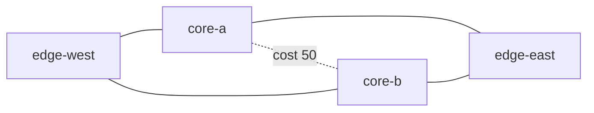

# OSPF Resiliency Lab

A reproducible four-router lab that proves equal-cost OSPF routing, injects a silent core-router failure, measures reconvergence, checks reachability, and confirms that both paths return after recovery.

The topology runs [FRRouting](https://frrouting.org/) 10.7.0 containers under [Containerlab](https://containerlab.dev/). All router configurations, addressing, validation logic, and CI are stored in the repository.



## What this demonstrates

- OSPFv2 single-area design with explicit router IDs
- Point-to-point adjacencies and matched Hello/dead timers
- Passive-by-default interface policy
- Equal-cost multipath through independent core routers
- A higher-cost core interconnect that stays out of the normal forwarding path
- Failure injection that exercises the OSPF dead timer
- Automated route, adjacency, reachability, and recovery assertions
- JSON evidence containing measured convergence and recovery times

## Addressing

| Node | Router ID | Transit interfaces |
| --- | --- | --- |
| `edge-west` | `10.255.0.1` | `10.0.12.1/30`, `10.0.13.1/30` |
| `core-a` | `10.255.0.2` | `10.0.12.2/30`, `10.0.24.1/30`, `10.0.23.1/30` |
| `core-b` | `10.255.0.3` | `10.0.13.2/30`, `10.0.34.1/30`, `10.0.23.2/30` |
| `edge-east` | `10.255.0.4` | `10.0.24.2/30`, `10.0.34.2/30` |

The complete machine-readable plan is in [`inventory.json`](inventory.json), and the design rationale is in [`docs/design.md`](docs/design.md).

## Run it

Use a Linux host with Docker, Containerlab, and Python 3.11 or newer.

```bash
git clone https://github.com/JohnnyZLi/OSPF-Resiliency-Lab.git
cd OSPF-Resiliency-Lab
make deploy
make verify
make destroy
```

`make verify` performs these steps:

1. wait for all expected OSPF adjacencies to reach Full;
2. confirm two selected next hops from `edge-west` to `10.255.0.4/32`;
3. verify baseline ICMP reachability;
4. pause `core-a`, leaving its links operational but stopping its control plane;
5. measure the time until only the `core-b` path remains;
6. verify reachability through the surviving path; and
7. unpause `core-a`, then confirm ECMP and all adjacencies recover.

The generated evidence is written to `evidence/latest-run.json`. See the full [runbook](docs/runbook.md) for manual inspection and recovery commands.

## Validate without deploying

```bash
make test
```

The standard-library test suite checks the addressing plan, link endpoints, FRR configuration, timer symmetry, OSPF policy, image pin, and verifier parsing.

## Continuous validation

GitHub Actions runs two levels of validation on every push and pull request:

- static tests on Python 3.11, 3.12, and 3.13; and
- an end-to-end job that installs a pinned Containerlab release, deploys all four FRR routers, injects the failure, uploads the JSON evidence, and destroys the lab.

## Design boundaries

This is a focused convergence lab, not a production reference architecture. The one-second Hello and three-second dead timers keep automated runs short; timer choices in a production network should reflect platform capabilities, scale, loss characteristics, and operational policy. The test measures control-plane observation from one source router and does not claim hitless forwarding.

## References

- [Containerlab quickstart](https://containerlab.dev/quickstart/)
- [Containerlab topology definition](https://containerlab.dev/manual/topo-def-file/)
- [FRRouting OSPFv2 documentation](https://docs.frrouting.org/en/latest/ospfd.html)
- [FRRouting releases](https://frrouting.org/release/)

## License

MIT
